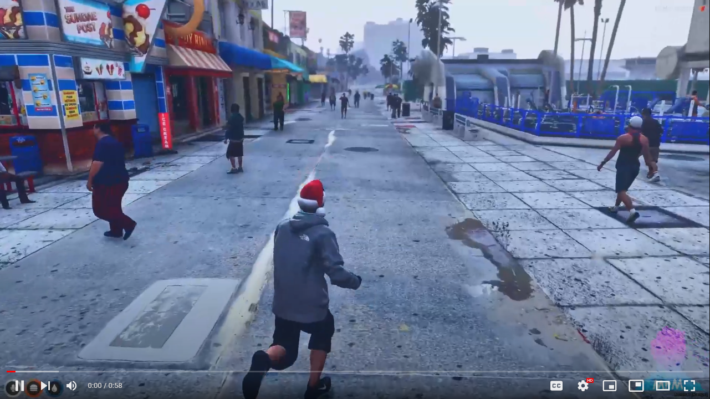

# **No More Bunny Hopping** 🐰🦘 [FREE-FiveM-Script]
### Are you tired of players who is, sprinting and jumping all the time like monkeys? 🐒

### Does it make your Roleplay Server looks stupid? No Worries! 😏 I got you.

<br>

[ ](http://www.youtube.com/watch?v=7MWZkqejidY "FiveM - Anti Bunny Hopping [FREE] 🐰 - standalone script") 

<br>

## Features 💼
- 🐇 Change the cooldown between each jump. `[configurable]`
- 🤪 Realastic ragdoll when falling.
- 🩸 Blood like screen filter when falling. `[configurable]`

---
## Requirements 🧰
- **Nothing.** Oh! But, Ofc You need a FiveM server. 😜
- This is a **standalone** script. It means this works on any framework. (QB, ESX, Whatever)

---
## Installation 🐌

```
- free download the script from my tebex.store (link down below ↓)
- unzip the file → mrm-betterjump
- place it somewhere in your server's resource folder
```

```
- add → ensure mrm-betterjump ...to your server.cfg
```
```
- edit the config.lua if you want to
- restart the server
```

### **📍 Keep in mind:**
> The script will not work, if you change the resource folder name to something else, other than **mrm-betterjump**. 

---

## Configuration File: 📃

```lua
Config = {}

-- 🕺🏽 Better Jump Limit; default 15
Config.jumpLimit = 15 -- higher the value → players can jump more

-- fall effect ✨
Config.fallEffect = true
```
---
## 🌎 [Download](https://mrm.tebex.io/package/5496492) :
> You can free download the script from my **[Tebex Store](https://mrm.tebex.io/package/5496492)**.

---
<details>
<summary>Tags</summary>
Anti Bunny Hopping, Anti Double Jump, No Bunny Hopping, No Double Jump, Disable Bunny Hopping, Disable Double Jump
</details>